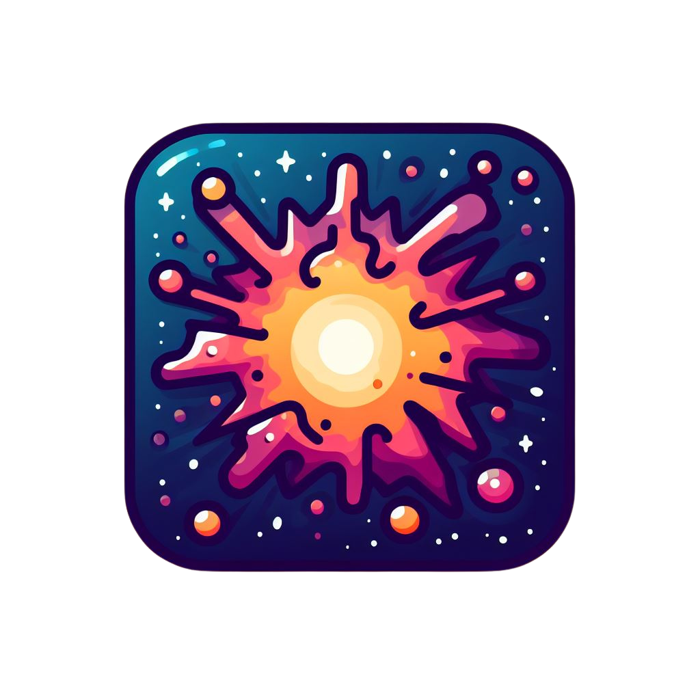

  
  <h1 align="center"> Supernova - Rocket Launches </h1>

 Mantenha-se atualizado(a) com os últimos lançamentos e eventos da Nasa, SpaceEx e muito mais.
  
 Muito obrigado a todo(as) responsáveis pelos mais de 300+ downloads do Supernova. 

  

  <a href="#-o-que-é">O que é?</a> •
  <a href="#-ios">iOS</a> •
  <a href="#-watch">Watch</a> •
  <a href="#-vision">Vision</a> •
  <a href="#-widgets">Widget</a> •
  <a href="#-próximos-passos">Próximos Passos</a> •
  <a href="#-curiosidade">Curiosidade</a> •
  <a href="#-autores">Autor</a>

### 🧐 O que é?

Supernova é uma solução inovadora para rastreamento de lançamentos de foguetes e notícias, disponível para iPhone, Apple Watch e Vision Pro, além de oferecer recursos de Widgets para a tela inicial. Com dedicação e empenho, desenvolvi essa aplicação para proporcionar aos usuários uma experiência de rastreamento de foguetes simplificada e eficiente, que integra as principais empresas como Nasa, SpacexEx e etc em uma interface única.

### 📱 iOS

A versão de iOS do supernova é a principal, na qual permite os usuários acompanharem os lançamentos, notícias e eventos relacionados a exploração espacial.  

## Especificações Técnicas 🛠

As seguintes tecnologias foram utilizadas neste projeto:    

* [x] Swift 5.7
* [x] Arquitetura MVVM
* [x] UIKit
* [X] View Code + Storyboard & Xib's
* [x] URLSession
* [x] Alamofire
* [X] Compositional Layout
* [X] Apple MapKit
* [X] Push Notifications
* [X] Background Tasks 

### 🕐 Watch

Porque não checar as informações dos próximos lançamentos de foguetes direto do seu pulso? A versão de Apple Watch de Supernova inclui todas as funcionalidade da versão de iOS, você pode checar a localização, ler notícias, eventos e até a foto do dia da Nasa.

## Especificações Técnicas 🛠

As seguintes tecnologias foram utilizadas neste projeto: 

* [x] Swift 5.7
* [x] Arquitetura MVVM
* [x] SwiftUI
* [x] Alamofire

### 📸 Vision

A versão para o Vision Pro foi o último grande lançamento do Supernova, disponível para o vision pro até antes de seu lançamento para os EUA. O que traz muito orgulho a mim ter uma solução desenvolvida por um brasileiro e lançado ao Vision Pro em seu lançamento.

     
     

## Especificações Técnicas 🛠

As seguintes tecnologias foram utilizadas neste projeto:

* [x] Swift 5.7
* [x] Arquitetura MVVM
* [x] SwiftUI
* [x] Alamofire
* [x] RealityKit

### Ilustrações

     
     
     
     

### 🪟 Widgets

Além de tudo isso, o supernova também tem os seus próprios Widgets, não necessitando nem abrir o aplicativo para checar o próximo lançamento ou visualizar a foto do dia da Nasa. 

### Widget próximo lançamento

Esse widget apresenta aos usuários o próximo lançamento com um contador, o mesmo sempre é atualizado automaticamente quando um próximo lançamento irá acontecer.

### Widget foto do dia da Nasa

Além disso, o meu widget preferido admito é o da imagem do dia na Nasa, tendo 2 tamanhos para que caibam perfeitamente na Home dos usuários. O widget apresenta uma imagem nova aos usuários todos os dias, assim deixando a interface da Home do iphone bem dinâmica e elegante.

### 😀 Próximos Passos

E para finalizar, o Supernova mensalmente recebe atualizações para incluir novas funcionalidades, por exemplo.

## Server Driven UI

O uso da tecnologia iria permitir modificar as interfaces sem necessitar atualizar e mandar uma nova versão para a Apple Store. O que está no roadmap de funcionalidades a serem adicionadas ao app até o fim do segundo semestre de 2024.

## Acessibilidade

Como relatado por usuários, o Supernova poderia suportar mais formas de acessbilidade para os usuários. Sendo assim, o nosso principal objetivo para a próxima versão do Supernova é suportar o Voice Over em todas as versões iOS, Watch e VisionOS.

### 🤔 Curiosidade

O nome "Supernova" do app se dá ao fenômeno também chamado de supernova que ocorre quando uma estrela atinge o fim de seu ciclo de vida e explode em uma explosão extremamente brilhante e poderosa. Esse fenômeno é conhecido por liberar uma quantidade imensa de energia e iluminar temporariamente sua galáxia.

O nome foi escolhido justamente pela alusão da solução do aplicativo, onde permite acompanhar diversos fatores da exploração espacial de diversas empresas, não focando apenas nas norte americanas. Sendo assim, o nome "supernova" faz a alusão de explosão de notícias, eventos, lançamentos tudo em um único local, a solução Supernova. 

### 😌 Autores

* Henrique Ferreira Marques Costa

  Desenvolvedor iOS a quase 3 anos, apaixonado por criar aplicativos excepcionais que fazem a diferença.

<table align="center">
  <tbody>
    <tr>
      <td align="center" valign="top" width="14.28%"><a href="https://github.com/RickyMarq"> <b>Henrique M</b></a> <a href="https://github.com/RickyMarq" </td>
    </tr>
  </tbody>
</table> 
